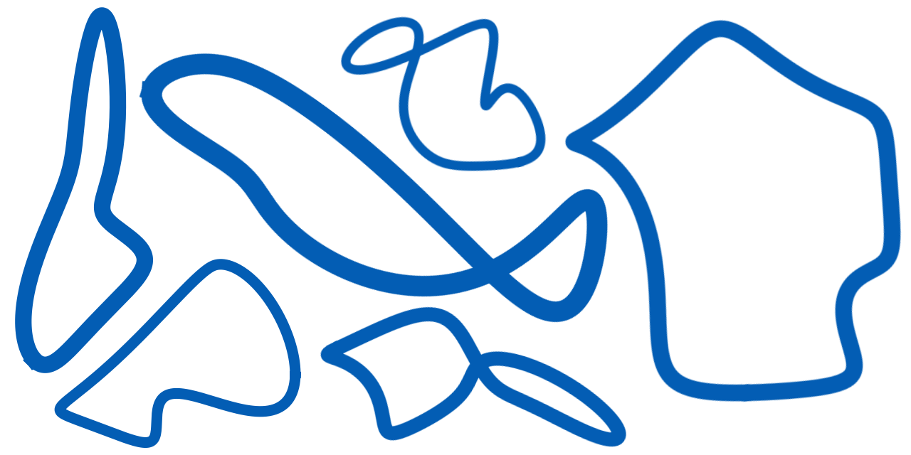
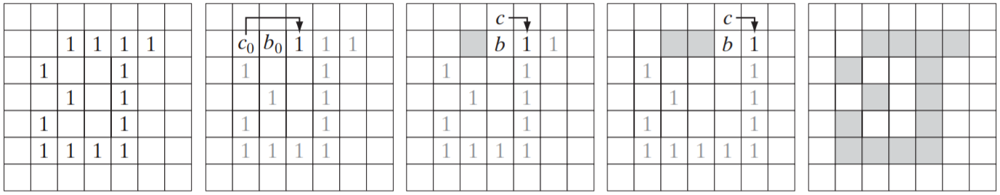
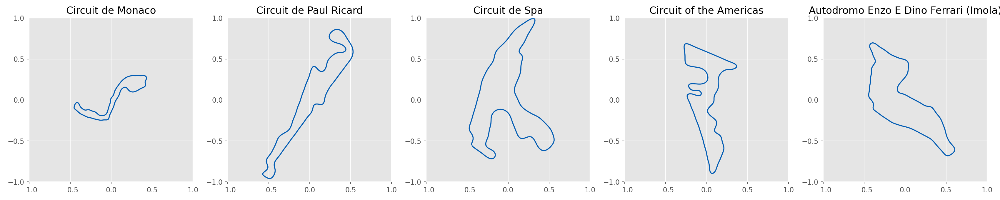
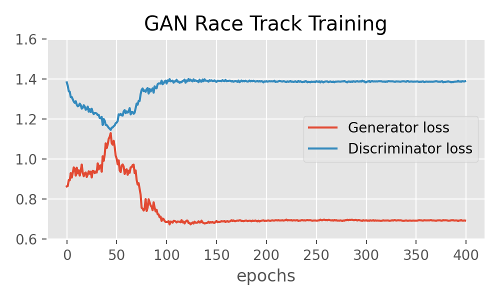

<h1 align = "center"> Race Track GAN </h1>

[![MIT License][license-shield]][license-url]
[![LinkedIn][linkedin-shield]][linkedin-url]

<p align="center">
    
</p>

This project aims at creating the most efficient race track generation model. To do so, we will leverage the frequency decomposition of race track curves to simplify their representations. However, available race track datasets are extremely limited. Only a few race tracks maps are available. Given the large number of samples needed to train a GAN, we will create our dataset. We will extract tracks from [Matt Dunlop's poster](https://www.redbubble.com/i/poster/Race-Tracks-to-Scale-Plain-Layouts-by-SirDunny/11752820.LVTDI) which contains 95 of the most iconic race tracks on to one image. Note that the generated dataset does not aim at being remarkably accurate; the rough shape of the tracks is enough to train the dataset, especially that they will be smoothed out through a low-pass filter.

- [Dataset creation](#dataset-creation)
  - [Description of the boundary following algorithm](#description-of-the-boundary-following-algorithm)
  - [Fourier Descriptors](#fourier-descriptors)
- [Custom GAN](#custom-gan)
  - [Architecture](#architecture)
  - [Training](#training)

## Dataset creation

There are three main steps involved in the creation of the dataset from the source image.
 - Find the location of each track in the image.
 - Extract the shape of each track using a boundary following algorithm.
 - Compute the Fourier descriptors of each track.

It can be reproduced using [this Python app](./src/get-tracks.py). The [final dataset](./data/tracks_fourier.json) contains arrays of coordinates and the associated 256 first Fourier descriptors of 77 tracks as a JSON file.

### Description of the boundary following algorithm

The shape must present clean and sharp edges. We can remove the noises and sharpen the image using a combination of a $9 \times 9$ averaging filter and Otsu's algorithm. These steps can be skipped in our case since the image is already well suited for the boundary following algorithm:

- Let the starting point, $b_0$, be the uppermost-leftmost point in the image. Store its coordinates. Denote by $c_0$ the west neighbor of $b_0$. Examine the 8-neighbors of $b_0$ starting at $c_0$ and proceeding in a clockwise direction. Let $b_1$ denote the first neighbor encountered whose value is 1, and let $c_1$ be the (background) point immediately preceding $b_1$ in the sequence.
- Initiate a couple of variables, $b=b_1$ and $c=c_1$.
- Let the N-neighbors (N being 4 or 8) of $b$, starting at $c$ and proceeding in a clockwise direction, be denoted by $\{n_i, \forall i \in [\![0, N-1]\!]\}$. Find the first $n_k$ labeled 1.
- Let $b=n_k$ and $c=n_{k-1}$.
- Repeat Steps 3 and 4 until $b=b_0$ and the next boundary point found is The sequence of points found when the algorithm stops constitutes the set of ordered boundary points

<p align="center">
    
</p>

<details>
    <summary>See Python implementation</summary>

```python
def boundary_following(border, stay_out=True, allow_diag=True):
    
    x_n = [0, -1, -1, -1,  0,  1, 1, 1] if allow_diag else [0, -1,  0, 1]
    y_n = [1,  1,  0, -1, -1, -1, 0, 1] if allow_diag else [1,  0, -1, 0]
    nbr_neighbore = len(x_n)
    angle = nbr_neighbore//2
    
    def get_neighbor(p,a):
        x, y = p[0] + x_n[a], p[1] + y_n[a]
        if (0 <= x < border.shape[0]) and (0 <= y < border.shape[1]):
            return border[x, y]
        else: return None

    b = find_upper_left(border)
    b_init = False
    coord_border = [b]
    chain_code = []

    while True:
        # Revolve around b until hit border
        while not get_neighbor(b, angle):
            angle = (angle - 1) if angle else (nbr_neighbore - 1)
        # Prefer direct neighbore
        if (not stay_out) and allow_diag and (angle%2 == 1) \
            and get_neighbor(b, (angle - 1) if angle else 7):
            angle = (angle - 1) if angle else (nbr_neighbore - 1)
        # Update b <- n(k)
        b = (b[0] + x_n[angle], b[1] + y_n[angle])
        # End condition: two successive boundary pixels already visited
        if b_init:
            if b == coord_border[1]: break
            else: b_init = False
        if b == coord_border[0]: b_init = True
        # Store new border pixel
        chain_code.append(angle)
        coord_border.append(b)
        # Reset angle, c <- n(k−1)
        angle = (angle+angle%2+2)%8 if allow_diag else (angle+1)%4
    return np.array(coord_border), chain_code
```
</details>

### Fourier Descriptors

The Fourier Transform (FT) has proven to be extremely useful in computer vision and signal processing in general. Once again, we can take advantage of the frequency representation of the shape's boundary series. The frequency representation of the tracks allow to reduce the quantity of data used to describe a boundary with virtually no resolution loss. In addition, such representation ensure the each generated track form a closing loop.

At first sight, one can think about using a 2D FT to generate the frequency description of a boundary due to its visual nature. However, tracks really are one-dimensional. Each coordinate pair can be treated as a complex number. Consider a boundary $\left\{\left(x_i, y_i\right), \forall i \in [\![0, K-1]\!] \right\}$,

$$ s(k) = y(k) + j \cdot x(k) $$

The classical one-dimensional Fourier Transform can be applied to this complex representation to obtain the Fourier descriptors $a(u)$ of the boundary. $\forall u \in [\![0, K-1]\!]$

$$ a(u) = \sum_{k=0}^{K-1} s(k) \cdot e^{-j 2 \pi \frac{uk}{K}} $$

Then, we can reconstruct the border using only a fraction of the available Fourier descriptors. Consider $P < K$ descriptors, $\forall p \in [\![0, P-1]\!]$

$$ \widehat{s}(p) = \frac{1}{K} \sum_{u=0}^{P-1} a(u) \cdot e^{j 2 \pi \frac{up}{K}} $$

Here is some examples of race tracks reconstructed using only 64 Fourier descriptors:

<p align="center">
    
</p>

## Custom GAN

### Architecture

GAN architecture generally implies convolutional layers. However, here we are not dealing with images but an array of complex numbers, our Fourier descriptors, which can then be used to draw a race track. Thus, the discriminator and the generator of our GAN model will be simple, fully connected networks. In addition, for the sack of simplicity and efficiency, we can set the order of the Fourier representation fairly low; let's say 10. Note that we have to flatten the complex representation so that the actual array length is 20. Such a low number ensures that we have reasonably good results even with our minimal dataset of 77 samples. We can use elementary models:


<table>
<tr><th> Generator (6 272 parameters) </th><th> Discriminator (5 409 parameters) </th></tr>
<tr><td style="min-width: 450px; vertical-align:top">

| Layer      | Output length | Number of Parameters |
| ---------- | :-----------: | :------------------: |
| Input      | 8             | 0                    |
| Dense (Leaky ReLu)       | 16            | 128                  |
| Batch Normalization      | 16            | 64                  |
| Dense (Leaky ReLu)       | 16            | 256                  |
| Batch Normalization      | 16            | 64                  |
| Dense (Leaky ReLu)       | 32            | 512                  |
| Batch Normalization      | 32            | 128                  |
| Dense (Leaky ReLu)       | 64            | 2048                  |
| Batch Normalization      | 64            | 256                  |
| Dense (Leaky ReLu)       | 32            | 2048                  |
| Batch Normalization      | 32            | 128                  |
| Dense (Leaky ReLu)       | 20            | 640                  |

</td><td style="vertical-align:top">

| Layer      | Output length | Number of Parameters |
| ---------- | :-----------: | :------------------: |
| Input      | 20            | 0                    |
| Dense      | 32            | 672                  |
| Dense      | 64            | 2112                 |
| Dense      | 32            | 2080                 |
| Dense      | 16            | 528                  |
| Dense      | 1             | 17                   |

</td></tr> </table>

Once trained, the generator can be easily embedded in a web application using TensorFlow.js given its low complexity. You can download a trained generator model [here](./track_generator.h5). This model has generated the illustration samples at the top of this page.

### Training

<p align="center">
    
</p>

<p align="center">
    
</p>


<!-- MARKDOWN LINKS & IMAGES -->
[license-shield]: https://img.shields.io/github/license/ArthurFDLR/race-track-generator?style=for-the-badge
[license-url]: https://github.com/ArthurFDLR/race-track-generator/blob/master/LICENSE
[linkedin-shield]: https://img.shields.io/badge/-LinkedIn-black.svg?style=for-the-badge&logo=linkedin&colorB=555
[linkedin-url]: https://linkedin.com/in/arthurfdlr/